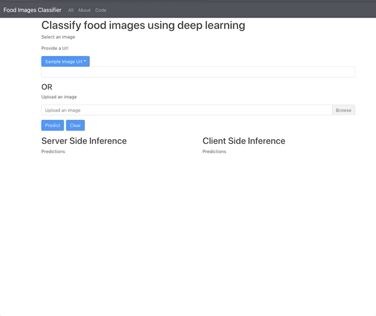

# Deploying Web App

## Overview 

This repo is a sample illustrating how to do TensorFlow browser based and server side inference.

In [backend](backend), is the server side inference code written in Python and served with FastApi.
In [frontend](frontend), is the browser based inference code written in Typescript / React 

The TensorFlow artifacts should be served at [here](backend/artifacts).
A sample artifact can be found in the repo [releases](https://github.com/reshamas/deploying-web-app/releases/tag/1.0.0-tfjs) 

## Demo 

Server Side Inference : [Heroku](https://manning-deploy-imagenet.herokuapp.com/)
Browse Based Inference: [Github Pages](https://reshamas.github.io/deploying-web-app/)





## Setup


## Converting TensorFlow model

It is strongly recommended to create a separate environment for `tesnorflowjs`

Installing tensorflowjs 
``` 
pip install tensorflowjs==2.3.0
```

Converting keras model located at `artifacts/model_tf_keras.h5` and saving to `artifacts/model_tfjs`
The `99999999` indicates that the model file should be split to 100 MB partitions.

The `quantize_float16=*`  decrease the default 32-bit precision to 16-bit precision which will reduce the model file size by half 

```
tensorflowjs_converter \
--input_format=keras \
--output_format=tfjs_graph_model \
--split_weights_by_layer \
--weight_shard_size_bytes=99999999 \ 
--quantize_float16=* \
artifacts/model_tf_keras.h5 artifacts/model_tfjs

```


## Local Deployment

```
docker build -t app .
docker run -p 8000:8000 -t app 
```

If you want to develop outside docker,
python (backend)
```
conda create -n dl_env python=3.7 
pip install -r backend/requirements.txt
```

frontend
```
yarn 
```


## Server Deployment

This app is deployed at Heroku.
Here are the steps for mac

Setup 
``` 
brew tap heroku/brew && brew install heroku
heroku login
heroku container:login
```

Replace `APP_NAME` with something unique
```


APP_NAME="manning-deploy-imagenet"
heroku create $APP_NAME

heroku container:push web --app ${APP_NAME}

heroku container:release web --app ${APP_NAME}
heroku open --app $APP_NAME
heroku logs --tail --app ${APP_NAME}
```

## Customizing
In order to prevent most frontend changes, most of the text and options are configured in this [config.yml](config.yaml).

